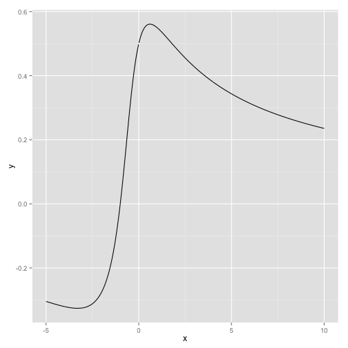
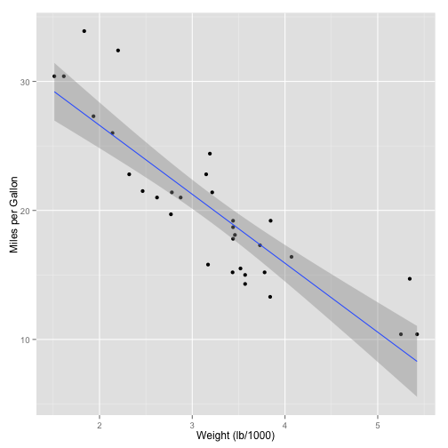

% A Shot at Reproducible Data Analysis
% Toni Verbeiren
% 15/9/2014

# Introduction

In this talk/document/presentation I showcase some of the possibilities that a combination of _tools_ provides:

* [Markdown](http://daringfireball.net/projects/markdown/)
* [RMarkdown](http://rmarkdown.rstudio.com/)
* [Knitr](http://yihui.name/knitr/)
* [Pandoc](http://johnmacfarlane.net/pandoc/)
* [Reveal.js](http://lab.hakim.se/reveal-js/#/)
* [Latex](http://www.latex-project.org/)

- - -

In order to make sure things look good from the first start, you might check out some additional projects and files:

* Bootstrap template for Pandoc: <https://github.com/tonyblundell/pandoc-bootstrap-template>
* Alternative LaTeX templates: <https://github.com/kjhealy/latex-custom-kjh>
* Alternative Pandoc template: <https://github.com/kjhealy/pandoc-templates>


# Idea

This is the general idea of the production workflow:

1. Write data generation, data manipulation and discussion in **one text file**.
    * Syntax for text is Markdown.
    * Code lines start with `tab` or delimited by `` ``` ``
    * Call this file `file.Rmd`, even if it includes more than `R` code.

2. Call `knitr` on the `.Rmd` file in order to **execute** the code blocks and **include** the output of the code in one file. The output is a `.md` file.

3. Call `Pandoc` on the file, given suitable options (see below). `Pandoc` is responsible for translating the `.md` file to **any format** you want. 

- - -

A simple and a more involved example of running `Pandoc`:

```shell
pandoc file.md -o $(FILE).docx

pandoc $(FILE).md -o $(FILE).html \
      -t html5 \
			--template $(THTML)/template.html \
			--css $(THTML)/template.css \
			--highlight-style=tango --mathjax \
			--toc --toc-depth 2
```

# Some Examples

- - -

## Simple example

The first example is in `R`. Let's say I want to plot a function

$$ f(x) = \frac{\log(x^2+x+1)}{2x} $$

We first define $x$ and the function value $y$ (in doing so we have used some inline equations as well):


```r
x <- seq(from=-5,to=10,by=.01)
y <- (log(x*x + x + 1))/(2*x)
```

- - -

Then we can plot the function. We use the `ggplot2` package.


```r
library(ggplot2)
qplot(x,y,geom="line")
```

 

See the figure for the result.

- - -

## Working with data

Let us take a look at a dataset that comes with `R`, `mtcars`:


```r
summary(mtcars)
```

```
##       mpg            cyl            disp             hp       
##  Min.   :10.4   Min.   :4.00   Min.   : 71.1   Min.   : 52.0  
##  1st Qu.:15.4   1st Qu.:4.00   1st Qu.:120.8   1st Qu.: 96.5  
##  Median :19.2   Median :6.00   Median :196.3   Median :123.0  
##  Mean   :20.1   Mean   :6.19   Mean   :230.7   Mean   :146.7  
##  3rd Qu.:22.8   3rd Qu.:8.00   3rd Qu.:326.0   3rd Qu.:180.0  
##  Max.   :33.9   Max.   :8.00   Max.   :472.0   Max.   :335.0  
##       drat            wt            qsec            vs       
##  Min.   :2.76   Min.   :1.51   Min.   :14.5   Min.   :0.000  
##  1st Qu.:3.08   1st Qu.:2.58   1st Qu.:16.9   1st Qu.:0.000  
##  Median :3.69   Median :3.33   Median :17.7   Median :0.000  
##  Mean   :3.60   Mean   :3.22   Mean   :17.8   Mean   :0.438  
##  3rd Qu.:3.92   3rd Qu.:3.61   3rd Qu.:18.9   3rd Qu.:1.000  
##  Max.   :4.93   Max.   :5.42   Max.   :22.9   Max.   :1.000  
##        am             gear           carb     
##  Min.   :0.000   Min.   :3.00   Min.   :1.00  
##  1st Qu.:0.000   1st Qu.:3.00   1st Qu.:2.00  
##  Median :0.000   Median :4.00   Median :2.00  
##  Mean   :0.406   Mean   :3.69   Mean   :2.81  
##  3rd Qu.:1.000   3rd Qu.:4.00   3rd Qu.:4.00  
##  Max.   :1.000   Max.   :5.00   Max.   :8.00
```

- - -

Now the fun starts. Let's fit a model relates how many Miles/Gallon are consumed, given a weight.


```r
model <- lm(mpg ~ wt, data=mtcars)
summary(model)
```

```
## 
## Call:
## lm(formula = mpg ~ wt, data = mtcars)
## 
## Residuals:
##    Min     1Q Median     3Q    Max 
## -4.543 -2.365 -0.125  1.410  6.873 
## 
## Coefficients:
##             Estimate Std. Error t value Pr(>|t|)    
## (Intercept)   37.285      1.878   19.86  < 2e-16 ***
## wt            -5.344      0.559   -9.56  1.3e-10 ***
## ---
## Signif. codes:  0 '***' 0.001 '**' 0.01 '*' 0.05 '.' 0.1 ' ' 1
## 
## Residual standard error: 3.05 on 30 degrees of freedom
## Multiple R-squared:  0.753,	Adjusted R-squared:  0.745 
## F-statistic: 91.4 on 1 and 30 DF,  p-value: 1.29e-10
```

- - -

This is verbatim output, we can use some `R` package magic to get proper tables as output as well using the `pander` package:


```r
library(pander)
pander(model)
```


--------------------------------------------------------------
     &nbsp;        Estimate   Std. Error   t value   Pr(>|t|) 
----------------- ---------- ------------ --------- ----------
     **wt**         -5.344      0.5591     -9.559   1.294e-10 

 **(Intercept)**    37.29       1.878       19.86   8.242e-19 
--------------------------------------------------------------

Table: Fitting linear model: mpg ~ wt

- - -

We can also plot this information using the code below.


```r
qplot(x=wt, y=mpg, data=mtcars, xlab="Weight (lb/1000)", ylab="Miles per Gallon",
      geom=c("point","smooth"), method="lm")
```

 

- - -

## Scraping the web

This script parses the Wikipedia page with Belgian Beers in order to get the data out.
It then does some cleaning up and converts the data to different formats.
The result can be stored  in a file, but just display the first 10 rows.

- - -


```r
library(XML)
rawBeers <- readHTMLTable(doc="http://nl.wikipedia.org/wiki/Lijst_van_Belgische_bieren")
beers <- NULL

# The first table is not relevant, the rest is:
for (i in seq(2,28)) {
  beers <- rbind(beers,rawBeers[[i]])
}

# Remove the percentage sign and convert to numbers:
beers$Percentagealcohol <- gsub("%","",beers$Percentagealcohol)
beers$Percentagealcohol <- gsub(",",".",beers$Percentagealcohol)
beers$Percentagealcohol <-as.numeric(beers$Percentagealcohol)
```

```
## Warning: NAs introduced by coercion
```

```r
# A few entries do not have a percentage entry
nas <- length(beers[is.na(beers$Percentagealcohol),])
```

- - -

The number of entries without percentage entry is: 4.

We use `pander` again for displaying the top-10 of beers with the highest amount of alcohol:

- - -


```r
pander(
  head(
    beers[order(beers$Percentagealcohol,decreasing=TRUE),
          c("Merk","Percentagealcohol")],
    10)
  )
```


---------------------------------------------------------
 &nbsp;              Merk              Percentagealcohol 
--------- --------------------------- -------------------
 **194**   Black Damnation V (Double          26         
                    Black)                               

 **405**    Cuv<U+00E9>e d'Erpigny            15         

 **189**         Black Albert                 13         

 **190**       Black Damnation I              13         

 **192**  Black Damnation III (Black          13         
                     Mes)                                

 **193**      Black Damnation IV              13         
             (Coff<U+00E9>e Club)                        

 **312**  Bush de No<U+00EB>l Premium         13         

 **313**         Bush de Nuits                13         

 **314**         Bush Prestige                13         

 **404**     Cuv<U+00E9>e Delphine            13         
---------------------------------------------------------


# Different languages

A Python example:


```python
import pprint
pprint.pprint(zip(('Byte', 'KByte', 'MByte', 'GByte', 'TByte'), (1 << 10*i for i in xrange(5))))
```

```
## [('Byte', 1),
##  ('KByte', 1024),
##  ('MByte', 1048576),
##  ('GByte', 1073741824),
##  ('TByte', 1099511627776)]
```

A Scala example:


```scala
val collection = for {i <- 1 to 10} yield {i}
val mapped = collection map (x => x*x)
val reduced = mapped reduce (_ + _)
println(reduced)
```

```
## 385
```


# What to use it for?

I use it for:

* Creating presentations (`reveal.js`)
* Writing reports (including code)
* Writing papers (just text)
* Making coffee


# Some additional pointers

* Markdown to `Reveal.js`: <http://tverbeiren.github.io/BigDataBe-Spark/#/>
* Markdown and `Pandoc` for writing a paper: <http://homes.esat.kuleuven.be/~bioiuser/blog/?p=243>
* Markdown and `Pandoc` for lecture notes: <https://bitbucket.org/tverbeiren/i0u19a>
* You can find everything I showed here at: <http://github.io/tverbeiren/ReproducibleDataAnalysis/>


