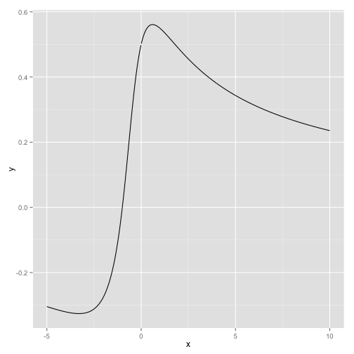
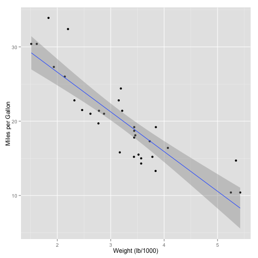
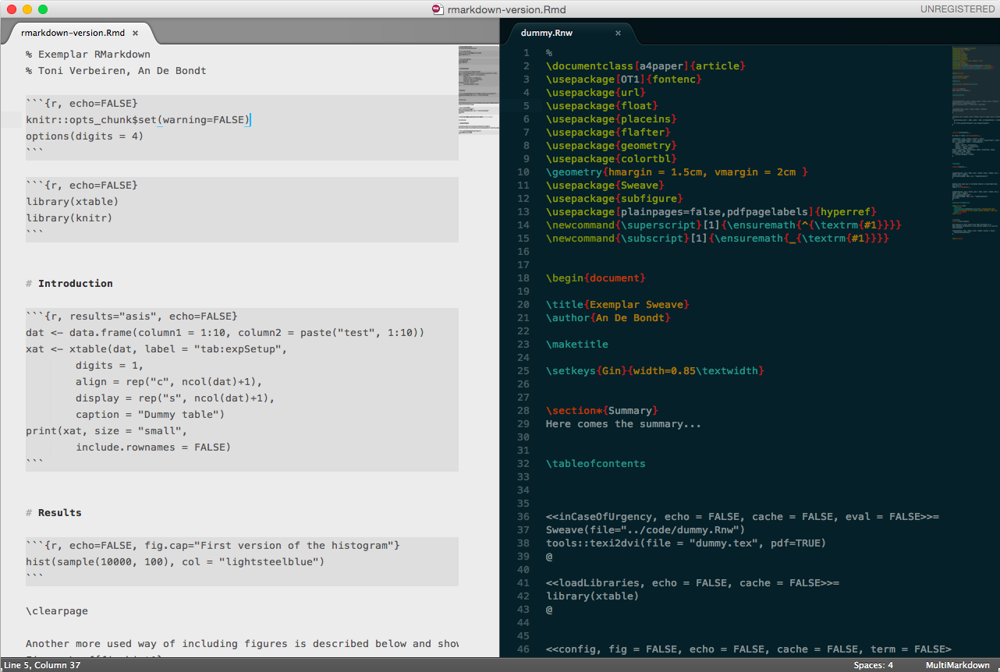
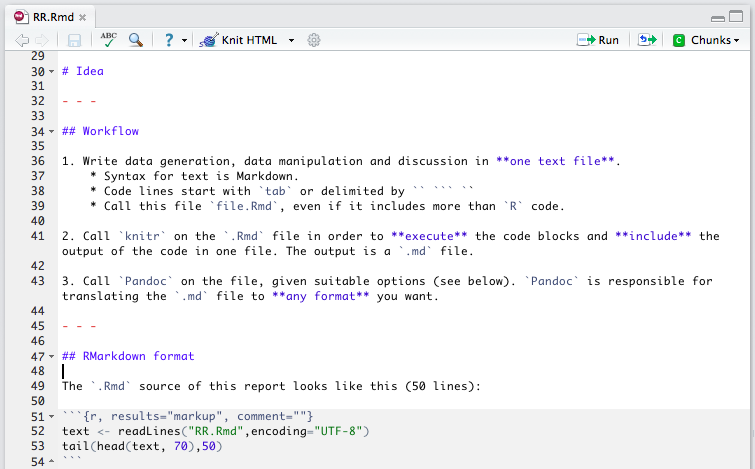
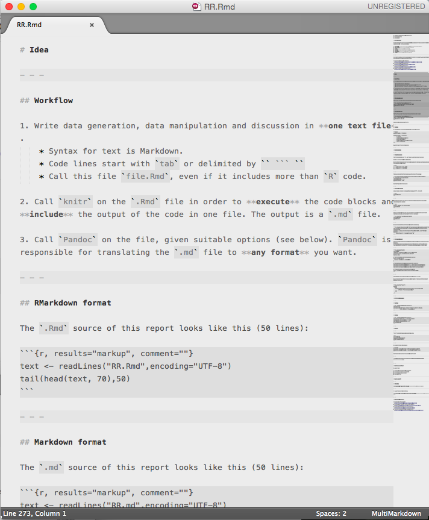

% A Shot at Reproducible Data Analysis
% Toni Verbeiren
% 13/3/2015

# Introduction

In this talk/document/presentation I showcase some of the possibilities that a combination of _tools_ provides:

* [Markdown](http://daringfireball.net/projects/markdown/)
* [RMarkdown](http://rmarkdown.rstudio.com/)
* [Knitr](http://yihui.name/knitr/)
* [Pandoc](http://johnmacfarlane.net/pandoc/)
* [Reveal.js](http://lab.hakim.se/reveal-js/#/)
* [Latex](http://www.latex-project.org/)


In order to make sure things look good from the first start, you might check out some additional projects and files:

* Bootstrap template for Pandoc: 
  <https://github.com/tonyblundell/pandoc-bootstrap-template>
* Alternative LaTeX templates: 
  <https://github.com/kjhealy/latex-custom-kjh>
* Alternative Pandoc template: 
  <https://github.com/kjhealy/pandoc-templates>
* Non-official KU Leuven templates:
  <https://github.com/exporl/kuleuven-templates>


# Idea


## Workflow

1. Write data generation, data manipulation and discussion in **one text file**.
    * Syntax for text is Markdown.
    * Code lines start with `tab` or delimited by `` ``` ``
    * Call this file `file.Rmd`, even if it includes more than `R` code.

2. Call `knitr` on the `.Rmd` file in order to **execute** the code blocks and **include** the output of the code in one file. The output is a `.md` file.

3. Call `Pandoc` on the file, given suitable options (see below). `Pandoc` is responsible for translating the `.md` file to **any format** you want. 


## RMarkdown format

The `.Rmd` source of this report looks like this (50 lines):


```r
text <- readLines("RR.Rmd",encoding="UTF-8")
tail(head(text, 70),50)
```

```
 [1] "  <https://github.com/tonyblundell/pandoc-bootstrap-template>"                                                                                             
 [2] "* Alternative LaTeX templates: "                                                                                                                           
 [3] "  <https://github.com/kjhealy/latex-custom-kjh>"                                                                                                           
 [4] "* Alternative Pandoc template: "                                                                                                                           
 [5] "  <https://github.com/kjhealy/pandoc-templates>"                                                                                                           
 [6] "* Non-official KU Leuven templates:"                                                                                                                       
 [7] "  <https://github.com/exporl/kuleuven-templates>"                                                                                                          
 [8] ""                                                                                                                                                          
[10] ""                                                                                                                                                          
[11] "# Idea"                                                                                                                                                    
[12] ""                                                                                                                                                          
[14] ""                                                                                                                                                          
[15] "## Workflow"                                                                                                                                               
[16] ""                                                                                                                                                          
[17] "1. Write data generation, data manipulation and discussion in **one text file**."                                                                          
[18] "    * Syntax for text is Markdown."                                                                                                                        
[19] "    * Code lines start with `tab` or delimited by `` ``` ``"                                                                                               
[20] "    * Call this file `file.Rmd`, even if it includes more than `R` code."                                                                                  
[21] ""                                                                                                                                                          
[22] "2. Call `knitr` on the `.Rmd` file in order to **execute** the code blocks and **include** the output of the code in one file. The output is a `.md` file."
[23] ""                                                                                                                                                          
[24] "3. Call `Pandoc` on the file, given suitable options (see below). `Pandoc` is responsible for translating the `.md` file to **any format** you want. "     
[25] ""                                                                                                                                                          
[27] ""                                                                                                                                                          
[28] "## RMarkdown format"                                                                                                                                       
[29] ""                                                                                                                                                          
[30] "The `.Rmd` source of this report looks like this (50 lines):"                                                                                              
[31] ""                                                                                                                                                          
[32] "```{r, results=\"markup\", comment=\"\"}"                                                                                                                  
[33] "text <- readLines(\"RR.Rmd\",encoding=\"UTF-8\")"                                                                                                          
[34] "tail(head(text, 70),50)"                                                                                                                                   
[35] "```"                                                                                                                                                       
[36] ""                                                                                                                                                          
[38] ""                                                                                                                                                          
[39] "## Markdown format"                                                                                                                                        
[40] ""                                                                                                                                                          
[41] "The `.md` source of this report looks like this (50 lines):"                                                                                               
[42] ""                                                                                                                                                          
[43] "```{r, results=\"markup\", comment=\"\"}"                                                                                                                  
[44] "text <- readLines(\"RR.md\",encoding=\"UTF-8\")"                                                                                                           
[45] "tail(head(text, 70),50)"                                                                                                                                   
[46] "```"                                                                                                                                                       
[47] ""                                                                                                                                                          
[48] "Conversion is done using `knitr`."                                                                                                                         
[49] ""                                                                                                                                                          
```


## Markdown format

The `.md` source of this report looks like this (50 lines):


```r
text <- readLines("RR.md",encoding="UTF-8")
tail(head(text, 70),50)
```

```
 [1] "  <https://github.com/tonyblundell/pandoc-bootstrap-template>"                                                                                                      
 [2] "* Alternative LaTeX templates: "                                                                                                                                    
 [3] "  <https://github.com/kjhealy/latex-custom-kjh>"                                                                                                                    
 [4] "* Alternative Pandoc template: "                                                                                                                                    
 [5] "  <https://github.com/kjhealy/pandoc-templates>"                                                                                                                    
 [6] "* Non-official KU Leuven templates:"                                                                                                                                
 [7] "  <https://github.com/exporl/kuleuven-templates>"                                                                                                                   
 [8] ""                                                                                                                                                                   
[10] ""                                                                                                                                                                   
[11] "# Idea"                                                                                                                                                             
[12] ""                                                                                                                                                                   
[14] ""                                                                                                                                                                   
[15] "## Workflow"                                                                                                                                                        
[16] ""                                                                                                                                                                   
[17] "1. Write data generation, data manipulation and discussion in **one text file**."                                                                                   
[18] "    * Syntax for text is Markdown."                                                                                                                                 
[19] "    * Code lines start with `tab` or delimited by `` ``` ``"                                                                                                        
[20] "    * Call this file `file.Rmd`, even if it includes more than `R` code."                                                                                           
[21] ""                                                                                                                                                                   
[22] "2. Call `knitr` on the `.Rmd` file in order to **execute** the code blocks and **include** the output of the code in one file. The output is a `.md` file."         
[23] ""                                                                                                                                                                   
[24] "3. Call `Pandoc` on the file, given suitable options (see below). `Pandoc` is responsible for translating the `.md` file to **any format** you want. "              
[25] ""                                                                                                                                                                   
[27] ""                                                                                                                                                                   
[28] "## RMarkdown format"                                                                                                                                                
[29] ""                                                                                                                                                                   
[30] "The `.Rmd` source of this report looks like this (50 lines):"                                                                                                       
[31] ""                                                                                                                                                                   
[32] ""                                                                                                                                                                   
[33] "```r"                                                                                                                                                               
[34] "text <- readLines(\"RR.Rmd\",encoding=\"UTF-8\")"                                                                                                                   
[35] "tail(head(text, 70),50)"                                                                                                                                            
[36] "```"                                                                                                                                                                
[37] ""                                                                                                                                                                   
[38] "```"                                                                                                                                                                
[39] " [1] \"  <https://github.com/tonyblundell/pandoc-bootstrap-template>\"                                                                                             "
[40] " [2] \"* Alternative LaTeX templates: \"                                                                                                                           "
[41] " [3] \"  <https://github.com/kjhealy/latex-custom-kjh>\"                                                                                                           "
[42] " [4] \"* Alternative Pandoc template: \"                                                                                                                           "
[43] " [5] \"  <https://github.com/kjhealy/pandoc-templates>\"                                                                                                           "
[44] " [6] \"* Non-official KU Leuven templates:\"                                                                                                                       "
[45] " [7] \"  <https://github.com/exporl/kuleuven-templates>\"                                                                                                          "
[46] " [8] \"\"                                                                                                                                                          "
[48] "[10] \"\"                                                                                                                                                          "
[49] "[11] \"# Idea\"                                                                                                                                                    "
[50] "[12] \"\"                                                                                                                                                          "
```

Conversion is done using `knitr`.


## Pandoc

A simple and a more involved example of running `Pandoc`:

```shell
pandoc file.md -o file.docx

pandoc file.md -o file.html \
      -t html5 \
			--template template.html \
			--css template.css \
			--highlight-style=tango --mathjax \
			--toc --toc-depth 2
```

Dust off your `Makefile` skills!


# Some Examples


## Simple example

The first example is in `R`. Let's say I want to plot a function

$$ f(x) = \frac{\log(x^2+x+1)}{2x} $$

We first define $x$ and the function value $y$ (in doing so we have used some inline equations as well):


```r
x <- seq(from=-5,to=10,by=.01)
y <- (log(x*x + x + 1))/(2*x)
```


Then we can plot the function. We use the `ggplot2` package.


```r
library(ggplot2)
qplot(x,y,geom="line")
```

 

See the figure for the result.


## Working with data

Let us take a look at a dataset that comes with `R`, `mtcars`:


```r
summary(mtcars)
```

```
##       mpg             cyl             disp             hp       
##  Min.   :10.40   Min.   :4.000   Min.   : 71.1   Min.   : 52.0  
##  1st Qu.:15.43   1st Qu.:4.000   1st Qu.:120.8   1st Qu.: 96.5  
##  Median :19.20   Median :6.000   Median :196.3   Median :123.0  
##  Mean   :20.09   Mean   :6.188   Mean   :230.7   Mean   :146.7  
##  3rd Qu.:22.80   3rd Qu.:8.000   3rd Qu.:326.0   3rd Qu.:180.0  
##  Max.   :33.90   Max.   :8.000   Max.   :472.0   Max.   :335.0  
##       drat             wt             qsec             vs        
##  Min.   :2.760   Min.   :1.513   Min.   :14.50   Min.   :0.0000  
##  1st Qu.:3.080   1st Qu.:2.581   1st Qu.:16.89   1st Qu.:0.0000  
##  Median :3.695   Median :3.325   Median :17.71   Median :0.0000  
##  Mean   :3.597   Mean   :3.217   Mean   :17.85   Mean   :0.4375  
##  3rd Qu.:3.920   3rd Qu.:3.610   3rd Qu.:18.90   3rd Qu.:1.0000  
##  Max.   :4.930   Max.   :5.424   Max.   :22.90   Max.   :1.0000  
##        am              gear            carb      
##  Min.   :0.0000   Min.   :3.000   Min.   :1.000  
##  1st Qu.:0.0000   1st Qu.:3.000   1st Qu.:2.000  
##  Median :0.0000   Median :4.000   Median :2.000  
##  Mean   :0.4062   Mean   :3.688   Mean   :2.812  
##  3rd Qu.:1.0000   3rd Qu.:4.000   3rd Qu.:4.000  
##  Max.   :1.0000   Max.   :5.000   Max.   :8.000
```


Now the fun starts. Let's fit a model relates how many Miles/Gallon are consumed, given a weight.


```r
model <- lm(mpg ~ wt, data=mtcars)
summary(model)
```

```
## 
## Call:
## lm(formula = mpg ~ wt, data = mtcars)
## 
## Residuals:
##     Min      1Q  Median      3Q     Max 
## -4.5432 -2.3647 -0.1252  1.4096  6.8727 
## 
## Coefficients:
##             Estimate Std. Error t value Pr(>|t|)    
## (Intercept)  37.2851     1.8776  19.858  < 2e-16 ***
## wt           -5.3445     0.5591  -9.559 1.29e-10 ***
## ---
## Signif. codes:  0 '***' 0.001 '**' 0.01 '*' 0.05 '.' 0.1 ' ' 1
## 
## Residual standard error: 3.046 on 30 degrees of freedom
## Multiple R-squared:  0.7528,	Adjusted R-squared:  0.7446 
## F-statistic: 91.38 on 1 and 30 DF,  p-value: 1.294e-10
```


This is verbatim output, we can use some `R` package magic to get proper tables as output as well using the `pander` package:


```r
library(pander)
pander(model)
```


--------------------------------------------------------------
     &nbsp;        Estimate   Std. Error   t value   Pr(>|t|) 
----------------- ---------- ------------ --------- ----------
     **wt**         -5.344      0.5591     -9.559   1.294e-10 

 **(Intercept)**    37.29       1.878       19.86   8.242e-19 
--------------------------------------------------------------

Table: Fitting linear model: mpg ~ wt


We can also plot this information using the code below.


```r
qplot(x=wt, y=mpg, data=mtcars, xlab="Weight (lb/1000)", ylab="Miles per Gallon",
      geom=c("point","smooth"), method="lm")
```

 


## Scraping the web

This script parses the Wikipedia page with Belgian Beers in order to get the data out.
It then does some cleaning up and converts the data to different formats.
The result can be stored  in a file, but just display the first 10 rows.


```r
library(XML)
rawBeers <- readHTMLTable(doc="http://nl.wikipedia.org/wiki/Lijst_van_Belgische_bieren")
beers <- NULL

# The first table is not relevant, the rest is:
for (i in seq(2,28)) {
  beers <- rbind(beers,rawBeers[[i]])
}

# Remove the percentage sign and convert to numbers:
beers$Percentagealcohol <- gsub("%","",beers$Percentagealcohol)
beers$Percentagealcohol <- gsub(",",".",beers$Percentagealcohol)
beers$Percentagealcohol <-as.numeric(beers$Percentagealcohol)
```

```
## Warning: NAs introduced by coercion
```

```r
# A few entries do not have a percentage entry
nas <- length(beers[is.na(beers$Percentagealcohol),])
```


The number of entries without percentage entry is: 4.

We use `pander` again for displaying the top-10 of beers with the highest amount of alcohol:


```r
pander(
  head(
    beers[order(beers$Percentagealcohol,decreasing=TRUE),
          c("Merk","Percentagealcohol")],
    10)
  )
```


--------------------------------------------------------
 &nbsp;              Merk             Percentagealcohol 
--------- -------------------------- -------------------
 **196**  Black Damnation V (Double          26         
                    Black)                              

 **412**       Cuvée d'Erpigny               15         

 **191**         Black Albert                13         

 **192**      Black Damnation I              13         

 **194**  Black Damnation III (Black         13         
                     Mes)                               

 **195**  Black Damnation IV (Coffée         13         
                    Club)                               

 **313**     Bush de Noël Premium            13         

 **314**        Bush de Nuits                13         

 **315**        Bush Prestige                13         

 **411**        Cuvée Delphine               13         
--------------------------------------------------------


# Different languages


## Python


```python
import pprint
pprint.pprint(zip(('Byte', 'KByte', 'MByte', 'GByte', 'TByte'), 
              (1 << 10*i for i in xrange(5))))
```

```
## [('Byte', 1),
##  ('KByte', 1024),
##  ('MByte', 1048576),
##  ('GByte', 1073741824),
##  ('TByte', 1099511627776)]
```


## Scala


```scala
val collection = for {i <- 1 to 10} yield {i}
val mapped = collection map (x => x*x)
val reduced = mapped reduce (_ + _)
println(reduced)
```

```
## 385
```


# Sweave


`knitr` can handle sweave documents as well.

```R
library(knitr)
Sweave2knitr('dummy.Rnw')
knit('dummy-knitr.Rnw')
```


Or, just write in RMarkdown:

```script
Rscript -e 'library(knitr); knit("rmarkdown-version.Rmd")
pandoc rmarkdown-version.md -o rmarkdown-version.pdf --toc
```

Text (and code) can be translated using `Pandoc`





# What to use it for?

I use it for:

* Creating presentations (`reveal.js`)
* Writing reports (including code)
* Writing papers (just text)
* Making coffee


# How to use it?


## RStudio




## _your favourite editor here_




# Additional pointers

* Markdown to `Reveal.js`: 
  <http://tverbeiren.github.io/BigDataBe-Spark/#/>
* Markdown and `Pandoc` for writing a paper: 
  <http://homes.esat.kuleuven.be/~bioiuser/blog/?p=243>
* Markdown and `Pandoc` for lecture notes: 
  <https://bitbucket.org/tverbeiren/i0u19a>
* You can find everything I showed here at: 
  <http://github.io/tverbeiren/ReproducibleDataAnalysis/>


